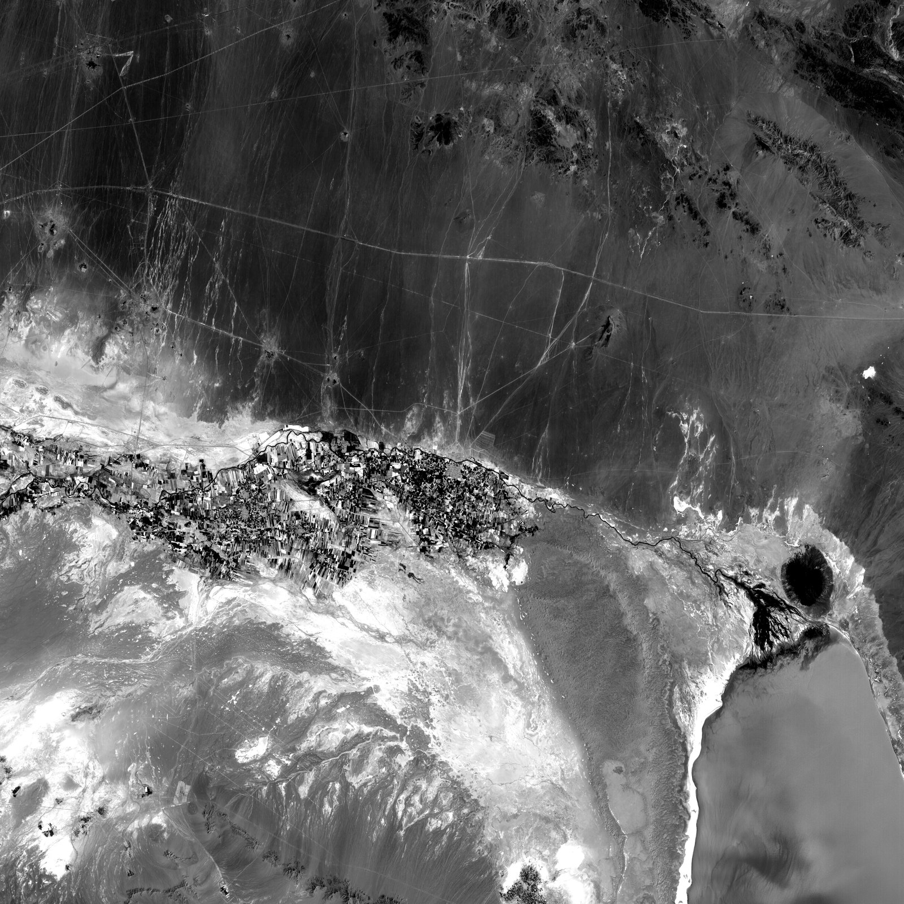
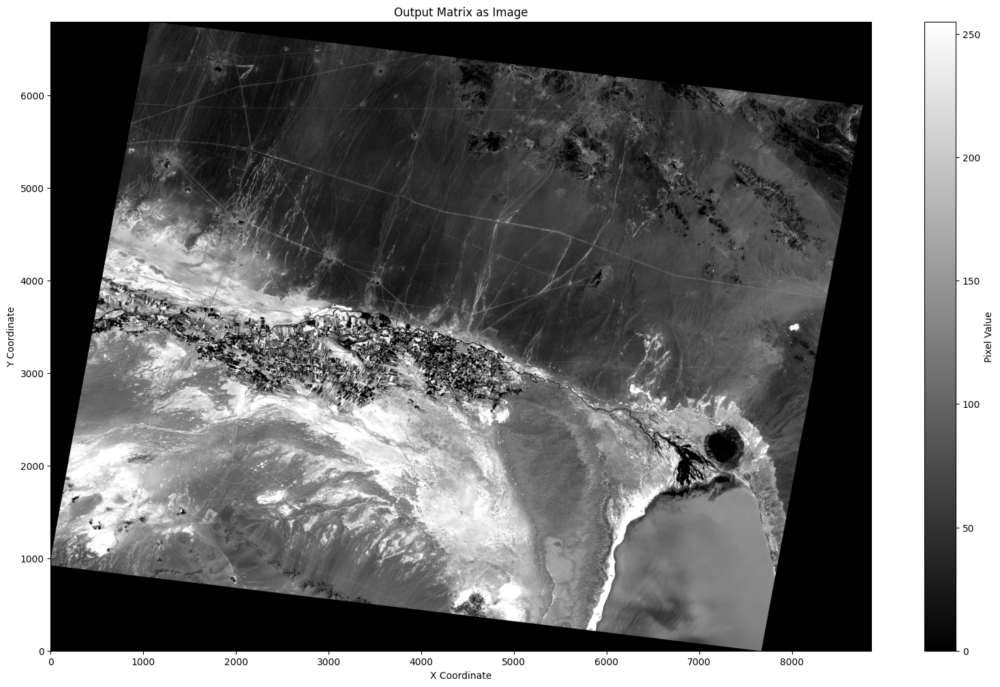

# Geometric Modeling and Orthorectification of Satellite Imagery

A three-part remote-sensing portfolio project covering SPOT image rectification, DEM-assisted orthorectification, and QuickBird-2 RPC/RFM geometric accuracy assessment.

> مجموعه‌ای سه‌مرحله‌ای شامل ترمیم هندسی تصویر SPOT، تولید ارتوفتو با استفاده از DEM و ارزیابی دقت مدل‌های RPC/RFM برای داده QuickBird-2.



## Project sequence

```text
SPOT image rectification → SPOT + DEM orthorectification → QuickBird-2 RPC/RFM assessment
```

| # | Project | Main methods | Included data |
|---|---|---|---|
| 01 | [SPOT Image Geometric Rectification](./01-geometric-image-rectification/) | Affine, conformal, projective and polynomial models | SPOT image + 38 observations |
| 02 | [DEM-Assisted SPOT Orthorectification](./02-dem-assisted-orthorectification/) | DEM integration, DLT, RFM and resampling | SPOT image + coordinates; DEM omitted |
| 03 | [QuickBird-2 RPC/RFM Accuracy Assessment](./03-quickbird-rpc-rfm-assessment/) | Terrain-dependent RFM, vendor RPC and bias refinement | 84 observations + RPC metadata |

## Highlights

- GCP/ICP selection and RMSE-based model comparison
- Empirical image-to-ground and ground-to-image modeling
- Nearest-neighbor and bilinear resampling
- DEM-assisted orthorectification
- Terrain-dependent and terrain-independent Rational Function Models
- QuickBird-2 vendor RPC evaluation and refinement

### Orthophoto outputs

| Nearest neighbor | Bilinear |
|---|---|
|  |  |

## Technical stack

Python, Jupyter Notebook, NumPy, pandas, OpenCV, Matplotlib, Rasterio and PyProj.

## Repository layout

- `data/spot/` — SPOT image and 38 image/ground coordinate observations
- `data/quickbird/` — 84 QuickBird-2 observations and RPC coefficients
- `data/dem/` — instructions for the omitted large DEM
- project `notebooks/`, `src/`, `reports/`, and `outputs/` folders

## Run

```bash
python -m venv .venv
# Windows: .venv\Scripts\activate
# macOS/Linux: source .venv/bin/activate
pip install -r requirements.txt
jupyter notebook
```

Projects 01 and 03 include their required inputs. Project 02 additionally requires `data/dem/Dem_Merge.tif`.

## Privacy and data notice

Student-identification numbers were removed from the public report copies. The supplied imagery and metadata are not covered by an open-source data license in this repository; verify original provider terms before copying or reusing them.

## Author

**Faezeh Sadeghi Niestanak**  
Geospatial Researcher · M.Sc. Student in Remote Sensing, University of Tehran
